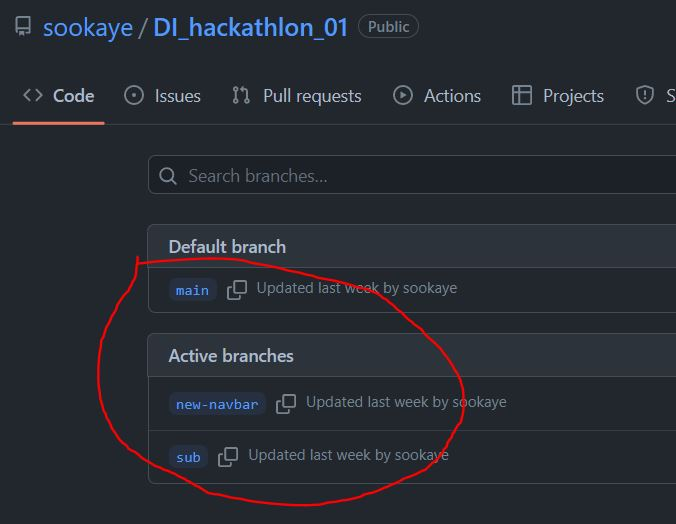
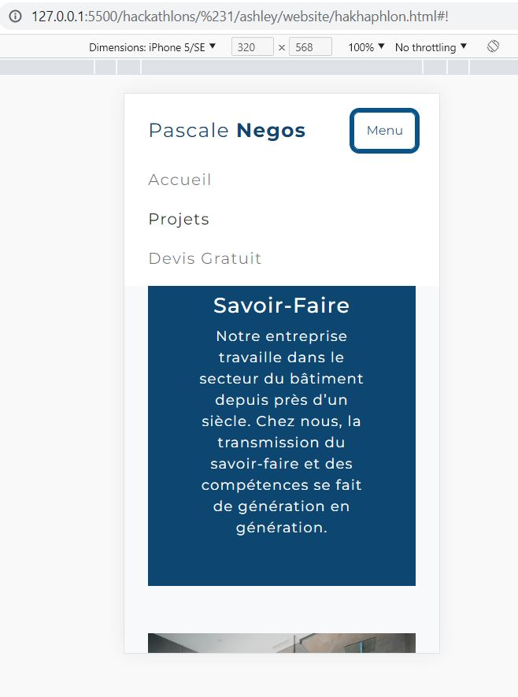

## Video ##
https://www.loom.com/share/1bdda4c932f944dfab785e0ac628e4f2

## Git ##
https://github.com/sookaye/DI_hackathlon_01

## COMMENTS ##
- GIT Sub Branches PRESENT :+1:
  <div>
    
  </div>
- Good responsiveness, nice mobile navbar :+1:
  <div>
    
  </div>
- console error in the javascript: "phoneNumberModalBtn" wasn't found in the html :-1:
  ```javascript
    document.getElementById('phoneNumberModalBtn').onclick = function() {
        openPhoneNumberModal();
    };
  ```
- Very nice coding, great use of functions to break down the project :+1:
- Unfortunatly, no demonstration of loops :-1:
- Good job, but no loops :disappointed: !