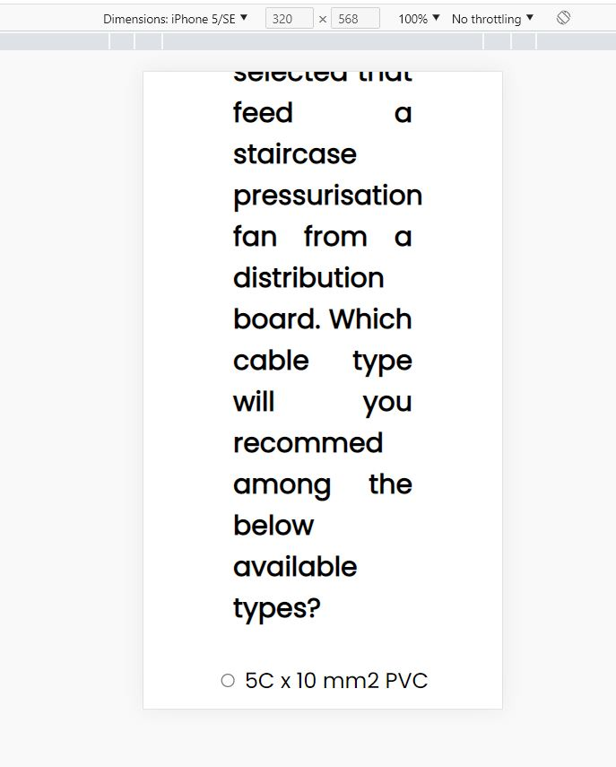
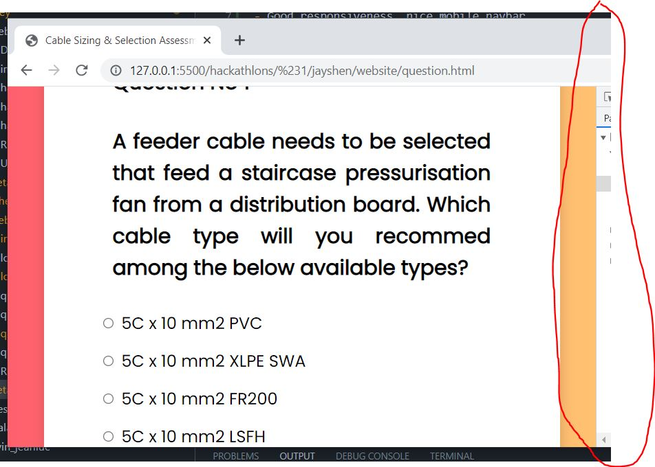

## Git ##
https://github.com/jayshen3072/hackathon_01

## COMMENTS ##
- NO VIDEO submited
- NO GIT Sub Branches
- NO responsiveness
  <div>
    
  </div>
- Line of code:
  ```javascript
  const buttonSubmit = document.getElementById('formButton')
  ```
  is invalid as no button with such id exists but with class "formButton" exists, thus code should be:
  ```javascript
  const buttonSubmit = document.querySelector('.formButton')
  ```
  **OR**
  ```javascript
  const buttonSubmit = document.getElementsByClassName('formButton')
  ```
- When login is done the page is redirected to "test.html", this page doesn't exists
  ```javascript
  buttonSubmit.addEventListener('click', () => {
    window.location.assign("test.html")
  });
  ```
  My guess, it should have been redirected to "question.html"
- No vertical scroll bar appear on small screens
  <div>
    
  </div>
- Nice javascript code. Good use of functions, and very nice binding of array "quizData" to DOM elements.
- Eventhough no loop present, very nice use of setInterval, which counts as a "loop mechanism"
  ```javascript
    button.addEventListener('click', () => {
      let interval = setInterval(() => {
          if (mins == 0) {
              timer.innerText = mins;
              clearInterval(interval);
              return;

          }
          timer.innerText = mins + ' Minutes Remaining';
          mins--;
      }, 60000);
    });
  ```
- Good job, unfortunatly does not satisfy requirements of the hackathlon, but very nice start.