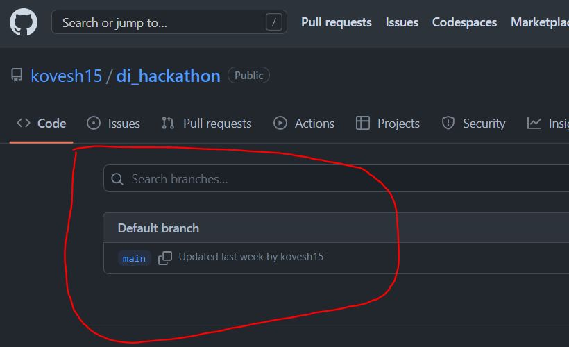
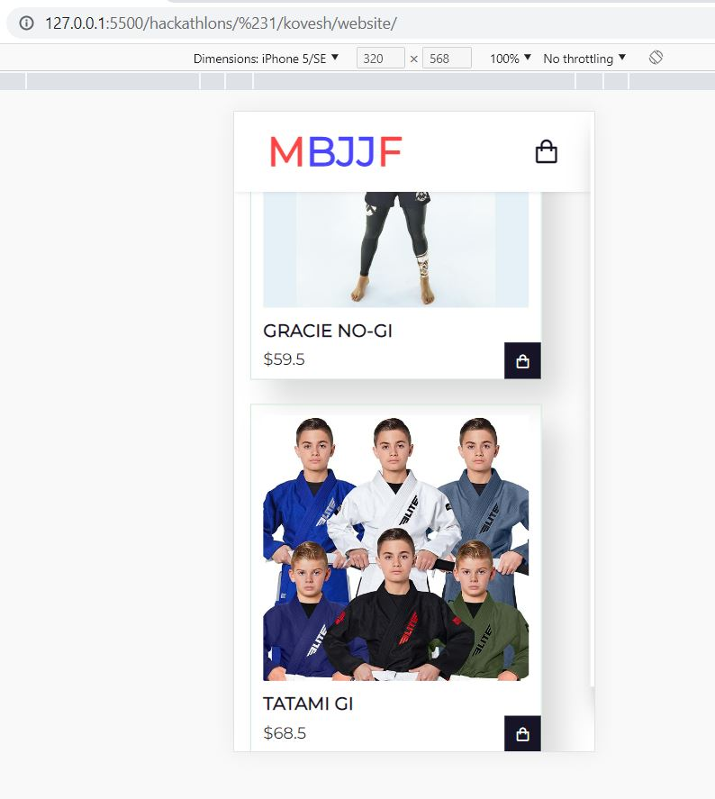
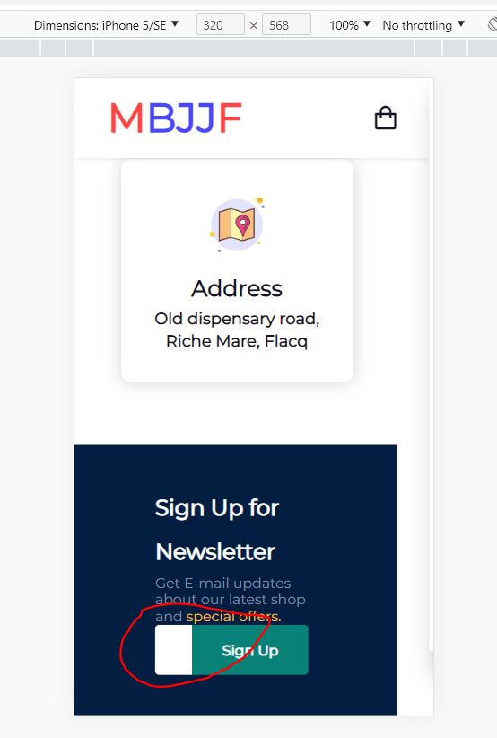
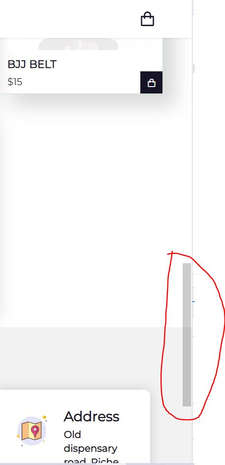

## Video ##
https://www.loom.com/share/6daae9b060e34c1399b3daf96736e769

## Git ##
https://github.com/kovesh15/di_hackathon#di_hackathon-1

## COMMENTS ##
- NO GIT Sub Branches :-1:
  <div>
    
  </div>
- Good responsiveness :+1:
  <div>
    
  </div>
- Responsiveness issue with signup form (Not "enough" input) :-1:
  <div>
    
  </div>
  Also you could have added some validation here. For example a proper email should be used before showing alert. :-1:

  ```javascript
    function myfunction() {
        alert("Successfully signed in");
    }
  ```
- In the following code a "form" element should have been used :-1:
  ```html
    <div class="form">
      <input type="text" placeholder="Your email address" name="mail" required>
      <button onclick="myfunction()" class="normal">Sign Up</button>
    </div>
  ```
- Nice transparent scroll bar :+1:
  <div>
    
  </div>
- Following code returns an error: :-1:
  ```javascript
        const btn = document.getElementById('btn');

        btn.addEventListener('click', function handleClick(event) {
        event.preventDefault();

        const firstNameInput = document.getElementById('first_name');

        // Send value to server
        console.log(firstNameInput.value);

        // 👇️ clear input field
        firstNameInput.value = '';
    });
  ```
  "btn" is undefined as there is no DOM element with id "btn"
- Clicking on an item should open the cart if the cart wasn't opened, as the user has no way of knowing that something just happened. :-1:
- Good use of functions and loops :+1:
- Overall good start but some functionalities are missing !