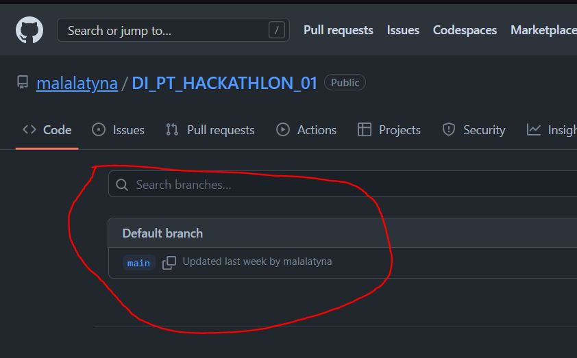
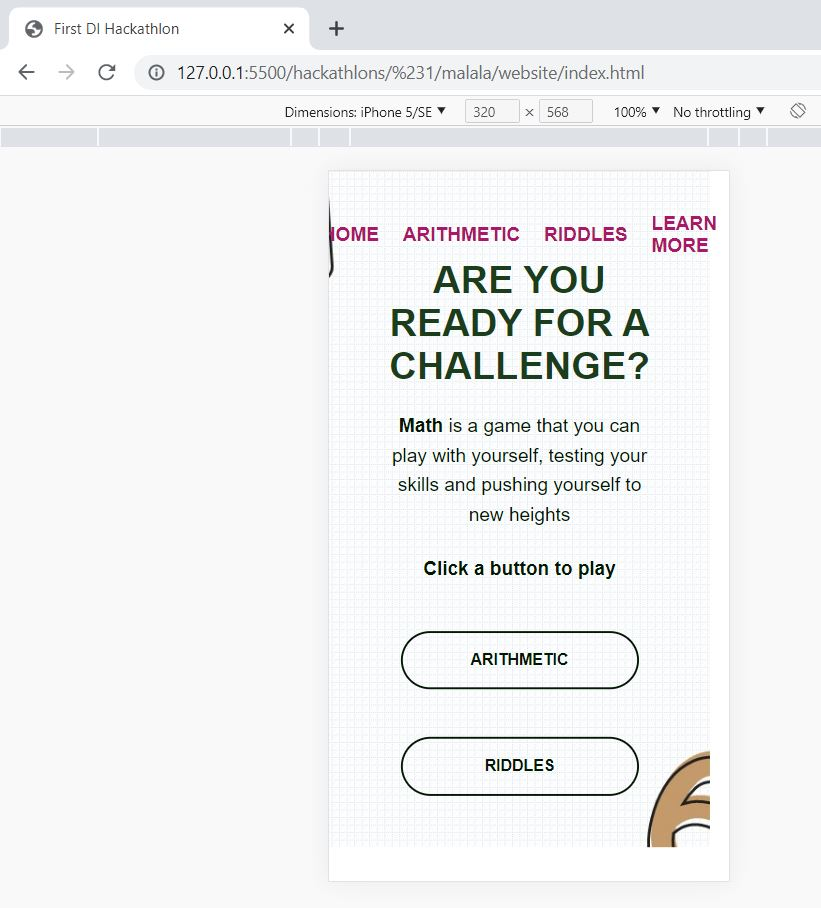
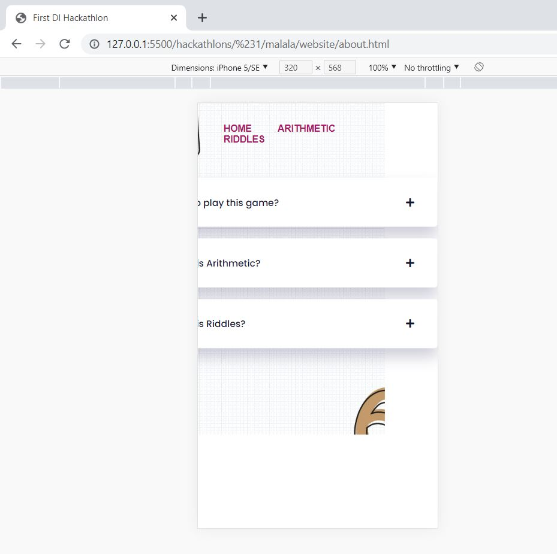

## Video ##
https://www.loom.com/share/5aaacab2974544cebb3fa06a4bb6db60

## Git ##
https://github.com/malalatyna/DI_PT_HACKATHLON_01

## COMMENTS ##
- NO GIT Sub Branches :-1:
  <div>
    
  </div>
- No responsiveness :-1:
  <div>
    
  </div>
  <div>
    
  </div>
- Love the about page, very nice animations :+1:
- Good use of functions and loops :+1:
- Very nice validation logic :+1:
- Great binding of the "questions" to DOM elements
- Here I would have use "form" elements as when pressing the "Enter" key on my keyboard, nothin happens
  ```html
    <div class="container"> 
        <div class="app">
            <h1>Math Riddles</h1>
            <div class="quiz">
                <h2 id="question"> Questions</h2>
                <div id="answer-buttons">
                    <button class="btn" id="option0"> Answer 1</button>
                    <button class="btn" id="option1"> Answer 2</button>
                    <button class="btn" id="option2"> Answer 3</button>
                    <button class="btn" id="option3"> Answer 4</button>
                </div>
            
                <button id="next-btn" onclick="move()">Next</button>

                <h2>Remaining question:</h2>
                <div id="myProgress">
                    <div id="myBar"></div>
                    </div>
                
            </div>
        </div>
    </div>
  ```
- Very nice project, near perfect, unfortunatly no responsiveness, but great start :tada: