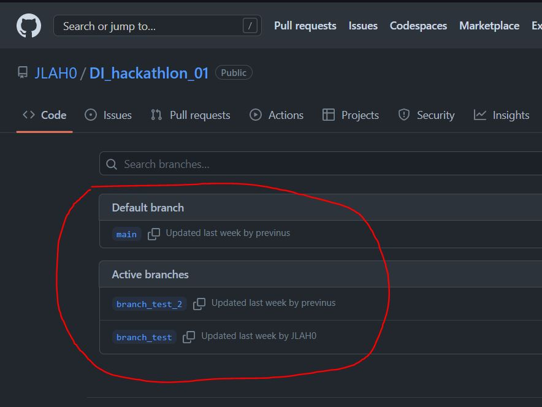
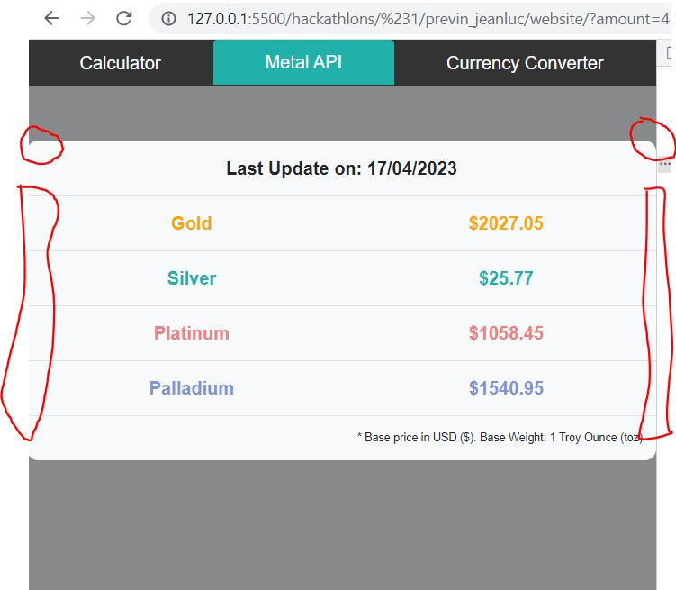

## Git ##
https://github.com/JLAH0/DI_hackathlon_01

## Video ##
https://www.loom.com/share/3bea419ce45e4a6790ef8823177c23d9

## COMMENTS ##
- GIT Sub Branches PRESENT :+1:
  <div>
    
  </div>
- Responsive. Good use of bootstrap grid (rows & cols) :+1:
- Impressive calculator :+1:
- Nice color transition on the background good use of setInterval :+1:
  ```javascript
    //function to call the background div and set the color
    const setRandomBackground = () => {
        let div = document.querySelector("body");
        let color = getRandomColor();
        div.style.transition = "background-color 2s ease-in-out";
        div.style.backgroundColor = color;
    }
    //initialize background color change function
    setInterval(setRandomBackground, 3000);
  ```
- Good use of the fetch function :+1:
  ```javascript
    /* Metals Api */
    const getMetalPromise = () => {
    const url = 'https://api.metals.live/v1/spot';
    const corsUrl = 'https://corsproxy.io'; // have to make use of a proxy because of cors issues

    return fetch(url)
        //fetch(corsUrl + '/?' + url)
        .then(response => response.json())
        .then(data => {
        // Return the data
        return data;
        })
        .catch(error => {
        // Handle any errors
        console.error(error);
        });
    }
  ```
- Some padding on the left and right would've been nice on small width screens + there is some "left over" border on top of the Metal table/list :-1:
  <div>
    
  </div>
- On the Converter tab, your aren't using the onsubmit event of the form element, even though you have a form element
  ```html
    <form>
        <div class="form-group">
        <label for="amount">Enter amount in MAURITIAN RUPEE (MUR):</label>
        <input type="number" class="form-control" id="amount" name="amount">
        </div>
        <div class="form-group">
        <label for="currency">Select currency to convert to:</label>
        <select class="form-control" id="currency" name="currency">
            <option value="AUD">Australian Dollar (AUD)</option>
            <option value="USD">U.S Dollar (USD)</option>
            <option value="CAD">Canadian Dollar (CAD)</option>
            <option value="EUR">Euro (EUR)</option>
            <option value="GBP">British Pound (GBP)</option>
            <option value="JPY">Japanese Yen (JPY)</option>
        </select>
        </div>
        <button type="button" class="btn btn-primary btn-style" onclick="convertCurrency()">Convert</button>
    </form>
  ```

  Which means that when the focus is on the "Enter Amount" input and the user presses the "Enter" button, the default form submit is trigerred and the page is refreshed. :-1:
- Good use of functions and loops :+1:
- Over all very nice project. Great implementation of API calls and binding data to DOM elements. Well done! :+1:
