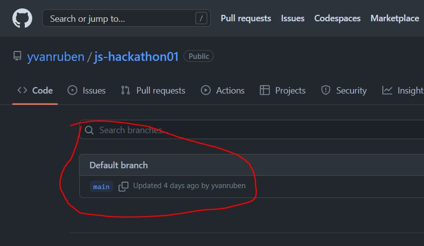
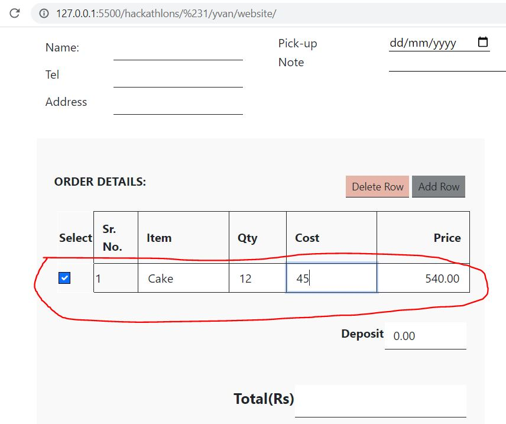

## Video ##
https://www.loom.com/share/123ab3147c374e1fa09f542d52b62365

## Git ##
https://github.com/yvanruben/js-hackathon01

## COMMENTS ##
- NO GIT Sub Branches :-1:
  

    
  

- Nice responsiveness :+1:
- Good use of functions and loops :+1:
- Good form validation :+1:
- The first element in the table cannot be deleted / isn't affected by the code
  

    
  

- Over all very nice project. A little lack of styling, but great start. Well done! :+1:
